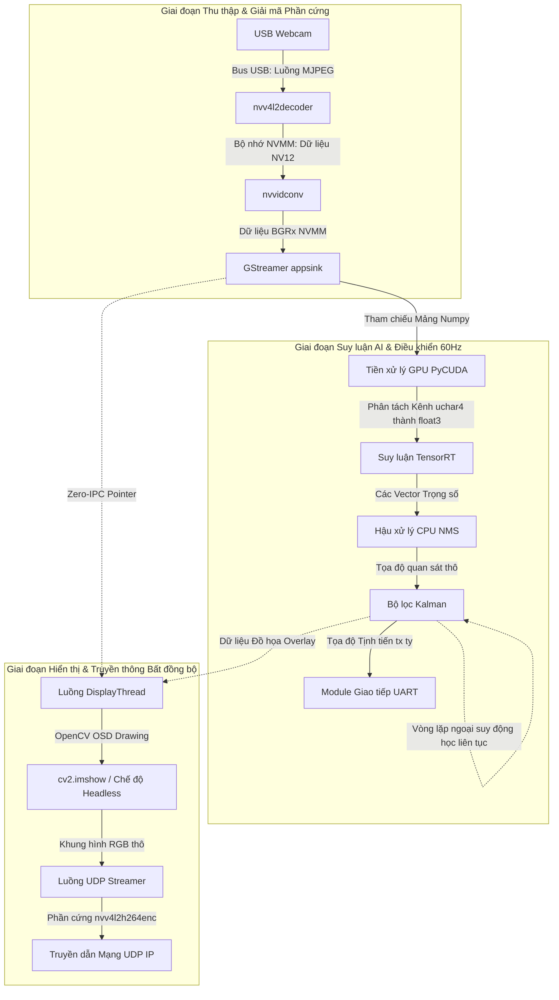

# TÀI LIỆU KIẾN TRÚC HỆ THỐNG: JETSON NANO VISION & CONTROL V2

**Phân loại:** Tài liệu Kỹ thuật Chuyên sâu (Technical Reference Manual)
**Hệ thống:** Robocon Vision Tracking System V2 
**Phần cứng nguyên bản:** NVIDIA Jetson Nano P3450 (4GB Unified Memory)
**Môi trường phần mềm:** Python 3.6, C++, CUDA 10.2, TensorRT 8.2, GStreamer, OpenCV

---

## 1. TỔNG QUAN KIẾN TRÚC HỆ THỐNG

Hệ thống được thiết kế theo triết lý "Hard Real-Time Soft-Simulation" (Mô phỏng tiệm cận thời gian thực cứng trên hệ điều hành nhân Linux phi thời gian thực). Cấu trúc của hệ thống ưu tiên tối đa việc bảo vệ chu kỳ nội suy động học và vòng lặp điều khiển UART khỏi độ trễ chặn (blocking delay) do cảm biến hình ảnh hoặc suy luận mạng nơ-ron gây ra.

### 1.1 Sơ đồ Chu trình Dữ liệu Cốt lõi

### 1.2 Phân tích Cấu trúc Module
* `src/system_manager_v2.py`: Đóng vai trò hạt nhân trung tâm (Master Controller). Chịu trách nhiệm quản lý máy trạng thái (State Machine), điều phối bộ đệm kép (Double-buffering), khởi tạo mô hình mạng nơ-ron, và duy trì một bộ định thời phần cứng (Hard-Timer loop) chạy độc lập ở tần số 60Hz để đảm bảo độ trễ điều khiển siêu thấp.
* `core/gst_camera.py`: Module giao tiếp phần cứng hình ảnh. Thực hiện nhiệm vụ duy nhất là trích xuất khung hình từ luồng thiết bị (/dev/video) và cấu hình chuỗi GStreamer nhằm kích hoạt phần cứng giải mã thay cho CPU, đồng thời xuất ra mảng Pixel theo định dạng bộ nhớ BGRx (4 kênh) có viền 32-bit alignment tiêu chuẩn của CUDA.
* `core/vision.py` & `core/trt_engine_v2.py`: Tầng bao bọc Trí tuệ Nhân tạo (AI Wrapper). Các file này quản lý vòng đời của bộ máy TensorRT. Xử lý việc nạp file `.engine`, khởi tạo ngữ cảnh Context Cuda, đăng ký bộ nhớ tĩnh (Pinned Memory) và điều phối lệnh truyền bộ nhớ DMA theo phương thức bất đồng bộ (Asynchronous execution).
* `core/cuda_preprocess.py`: Modun tiền xử lý CUDA Kernel (`.cu`). Modun này từ chối việc sử dụng CPU OpenCV để chuyển đổi không gian màu. Thay vào đó, nó chia cắt mảng `BGRx` trực tiếp trên bộ nhớ GPU, bóc tách các kênh và thực hiện chuẩn hóa (Normalization) để đưa thẳng vào mô hình TensorRT dưới dạng Tensor Float3xCxHxW.
* `core/async_display.py` & `core/udp_streamer.py`: Khối quan sát (Visualization). Hoạt động hoàn toàn trên các luồng độc lập (Threading) để nhận tín hiệu đồ họa (Bounding Box, Track lines) từ luồng chính, vẽ OSD (On-screen Display) và gửi video nén H.264 qua giao thức UDP bởi sự can thiệp của bộ mã hóa GPU (NVENC).
* `global_config.yaml`: Trung tâm tham số tập trung. Cho phép tùy chỉnh trạng thái không cần biên dịch lại mã nguồn Python.

---

## 2. CHUỖI XỬ LÝ TỪ THỊ GIÁC ĐẾN CHUYỂN ĐỘNG (VISION-TO-ACTUATION PIPELINE)

Một chu kỳ từ khi cảm biến tiếp nhận ánh sáng đến khi động cơ thay đổi góc quay có thể được ước lượng qua thang thời gian vi mô (vi phân theo miligiây):

1. **[T=0ms] Truyền dẫn Bus USB:** Webcam xuất tín hiệu đã được mã hóa chuẩn MJPEG thông qua hệ thống dây USB 2.0/3.0.
2. **[T=2ms] Giải mã Phần Cứng:** GStreamer gọi node `nvv4l2decoder`. Khối giải mã phần cứng NVDEC bẻ gãy khối MJPEG nén thành khung hình YUV dạng NV12 tại vùng nhớ liền kề (NVMM) không thông qua bộ xử lý trung tâm ARM.
3. **[T=4ms] Chuyển đổi Cơ sở Không gian Màu:** `nvvidconv` dịch chuyển dải màu NV12 thành mảng 4 chiều (BGRx) nhằm căn chỉnh phân vùng 32-bit của kiến trúc CUDA. Dữ liệu được đưa tới User Space `cv::Mat` của viện OpenCV. Quá trình này không yêu cầu sức tải tính toán nội suy từ CPU.
4. **[T=5ms] Tải Dữ liệu Cuda (CUDA Upload):** Vòng lặp chính 60Hz ngậm mảng dữ liệu BGRx. Câu lệnh `cuda.memcpy_htod_async` được kích hoạt mang dữ liệu phóng thẳng vào VRAM. Lõi `cuda_preprocess.cu` phân rã BGRx thành mảng Chuẩn hóa (Normalized FP16/FP32 Tensors) phù hợp với trọng số của kiến trúc YOLO.
5. **[T=8ms] Nội suy Học Sâu (Zero-Copy Inference):** TensorRT thực hiện chạy Lan truyền Tiến (Forward Propagation). Lệnh `Execute v2` tính toán trên bộ nhớ cố định (Pinned Memory) loại bỏ các bước truyền mảng từ CPU sang GPU tốn kém theo mô hình IPC truyền thống.
6. **[T=23ms] Triệt tiêu Cực đại Địa phương (NMS) & Theo dõi (Tracking):** CPU tiến hành thuật toán Non-Maximum Suppression (NMS) để gọt bỏ các hộp Bounding Boxes thừa, cô lập tọa độ trọng tâm hình học (Tọa độ x, y).
7. **[T=25ms] Tịnh tiến Không gian Toán học:** Bộ lọc Kalman nội suy tọa độ. Thông quá trị số `dt` (thời gian delta) đã được làm phẳng qua bộ lọc thông thấp (Low-Pass Filter), Kalman thực hiện hàm Cập Nhật (Update).
8. **[T=26ms] Truyền thông Ngoại vi (Actuation):** Cổng Dữ liệu Tuần tự RS232/TTL (UART) chuyển đổi Payload thành các chuỗi Byte. Robot nhận tín hiệu tịnh tiến. Hoàn thành một chu kỳ điều khiển vòng kín.

---

## 3. GIAO THOA PHẦN CỨNG VÀ PHẦN MỀM (HARDWARE-SOFTWARE SYNERGY)

Hệ thống vắt kiệt hiệu năng từ hệ thống trên chip (SoC) Tegra X1 của NVIDIA bằng giao thức khai thác các khối Silicon chuyên biệt, nhằm phân tải toàn diện cho nhân CPU ARM A57 vốn dĩ gặp hạn chế về kiến trúc tập lệnh phức tạp:

* **Video Image Compositor (VIC)**: Khối vi mạch xử lý Ảnh số. NVVIDCONV dùng VIC để thay đổi kích thước (Resizing/Scaling) khung hình trực tiếp bằng phần cứng mà không ngậm tài nguyên xung nhịp xử lý CPU.
* **NVIDIA Decoder (NVDEC)**: Vi mạch thụ động chuyên dụng có nhiệm vụ giải nén các chùm dữ liệu MJPEG từ Webcam ra dải NV12 YUV thô (Kích hoạt qua lệnh pipeline `nvv4l2decoder mjpeg=1`) ở vận tốc lớn hơn 60 khung hình/giây.
* **NVIDIA Encoder (NVENC)**: Vi mạch mã hóa chuyên dụng nằm ở dải phần cứng đồ họa chuyên biệt. Khi hệ thống yêu cầu đường truyền UDP Streamer, NVENC gánh vác vòng lặp nén video sang chuẩn H.264 thông qua tham số `nvv4l2h264enc`.
* **Unified Memory Architecture (Cấu trúc Bộ nhớ Hợp nhất)**: Jetson Nano chia sẻ RAM toàn cục giữa ARM CPU và Maxwell GPU. Kỹ thuật `cuda.pagelocked_empty` tạo ra các Page-Locked Buffer, qua đó cấp phép cho thuật toán DMA (Direct Memory Access) luân chuyển dữ liệu không yêu cầu OS Kernel ngắt trang xử lý (Page Fault), cắt giảm rào cản tắc nghẽn BUS PCIe truyền thống trên PC.

---

## 4. NỀN TẢNG TOÁN HỌC KỸ THUẬT VÀ THUẬT TOÁN

### 4.1 Bộ lọc Kalman, Sự dao động (Jitter), và Hệ số Lọc Thông Thấp (EMA)
Thuật toán Kalman được ứng dụng như một mạng lưới ngoại suy vận động học cơ bản (Kinematics Extrapolation) thay vì phương pháp bám bắt tĩnh.
* **Nhiễu thời gian thực trên Linux**: Hệ điều hành Linux (Non-RTOS) gây ra sự trồi sụt tín hiệu (Jitter) trong vòng lặp thời gian delta (`dt` = 12ms, 8ms, 15ms). Sự dao động này khi đưa thẳng vào ma trận chuyển đổi (Transition Matrix) sẽ tạo ra xung siêu âm trong ma trận Hiệp Phương Sai (Covariance Matrix - P) và Lợi ích Kalman (Kalman Gain - K), gây hiện tượng giật lắc tọa độ ngõ ra.
* **Mô hình làm mịn tịnh tiến EMA (Exponential Moving Average)**:
  Công thức tích hợp: `dt_filtered = alpha * dt_raw + (1 - alpha) * dt_filtered`
  Với hệ số `alpha` = 0.1, giá trị `dt` đi vào bộ lọc Kalman là một dải tần siêu mượt, loại trừ triệt để hiệu ứng giật khung hình do ngắt phần cứng (Hardware Interrupts) gây ra.
* **Ma trận Quan Trạng Thái (Transition Matrix Equation):**
  Phương trình động học bậc 1:
  [X_k, Y_k, dX_k, dY_k]^T = F * [X_k-1, Y_k-1, dX_k-1, dY_k-1]^T
  Với F là ma trận đơn vị chứa tham số thời gian delta `dt` tại hàng (0,2) và (1,3).
* **Quán tính Trôi (Inertial Coasting)**: Bằng cách tháo nút thắt thắt cổ chai kết nối đồng bộ Camera, nếu luồng dữ liệu USB gặp tắc nghẽn, Kalman lọc hàm Update (Không có dữ liệu đo đạc) và chỉ thực thi hàm Predict. Hệ thống Robot sẽ di chuyển dựa trên vectơ Vận tốc (`dx, dy`) cuối cùng được tính toán.

### 4.2 Xử lý Hình học Biến đổi (Letterboxing)
Việc ép cứng tỷ lệ hình ảnh gốc bằng hàm Resize sẽ hủy hoại tỷ lệ khung hình (Aspect Ratio), làm méo mó các đặc trưng trích xuất chập (Convolution Feature Maps) của mô hình. 
Bộ thuật toán Letterboxing bù đắp các viền đen (Padding) và tính toán tỷ lệ Phóng đại (Scale Factor). Khi mạng nơ-ron nhận diện thành công, các hộp Bounding Boxes được lập trình nội suy nghịch đảo đối chiếu lại không gian tọa độ thô, đảm bảo sai số đo lường học không vượt quá 1 Pixel gốc.

---

## 5. CHIẾN LƯỢC QUẢN LÝ ĐA LUỒNG VÀ CHỐNG TRÀN BỘ NHỚ (OOM PREVENTION)

Jetson Nano 4GB là thiết bị có khả năng xảy ra Tràn bộ nhớ cực cao (Out-of-Memory) nếu kiến trúc phần mềm xử lý quản lý tiến trình không chính xác.

### 5.1 Giới hạn của Multiprocessing & Copy-On-Write (CoW)
Về mặt lý thuyết Hệ điều hành Linux, việc rẽ nhánh bằng Cài đặt Tiến trình (Multiprocessing fork) tiết kiệm RAM bằng quy tắc Copy-On-Write. Tuy nhiên, việc tồn tại Driver GPU phức tạp nạp ngữ cảnh CUDA sẽ chặn Cấp phát đồng bộ Cache, dẫn đến Hệ điều hành ép buộc phải phân trang bộ nhớ thủ công, trực tiếp nhân đội (Duplicate) toàn bộ 2GB RAM mô hình của luồng mẹ.
Ngoài ra, việc dùng Pickle mã hóa dữ liệu truyền tải hình ảnh RGB kích thước lớn (IPC IPC Overhead) gây ra thắt nút tính toán diện rộng.

### 5.2 Khai sinh DisplayThread & Mutex Zero-IPC
Cấu trúc chuyển hoàn toàn tiến trình hiển thị thành Threading. Theo ngôn ngữ quản trị luồng:
* Các mảng Numpy (BGR Image) đẩy bằng Queue thực chất chỉ đang luân chuyển "Con trỏ Vị trí Nhớ" (Pointer references). Tài nguyên truyền tải giảm đến 99% so với kiến trúc cũ.
* Vấn đề khóa thao tác song song của Python (Global Interpreter Lock - GIL) được giải quyết ở cuối chu kỳ Thread hiển thị bằng vòng lặp I/O `cv2.waitKey(1)`. Thao tác nhập xuất cửa sổ đồ họa lập tức nhả mã khóa GIL, giữ cho luồng trí tuệ nhân tạo độc lập ở mức ưu tiên phần cứng, duy trì nhịp vòng lặp luôn cao hơn yêu cầu cấu hình (>= 50Hz) để gửi Data UART xuyên suốt.

---

## 6. QUẢN LÝ CẤU HÌNH VÀ KHẢ NĂNG MỞ RỘNG (SCALABILITY)

Tham số trung tâm tập hợp tại file `global_config.yaml`. Dev-ops có thể vận hành đa trạng thái trên sân đấu mà không tái cơ cấu cấu trúc tệp mã nguồn đắt đỏ:
* Chế độ Câm (Headless Mode): Tham số `headless: true`. Đây là bản chất của Robot công nghiệp thực chiến. Mọi cửa sổ đồ họa X11 được loại bỏ. Giao tiếp qua Bus hệ thống và bộ đệm L2 Cache dồn sức ép cho tính toán Ma trận điểm ảnh.
* Chế độ Quan Trắc Băng thông Thấp (UDP Streamer): Kích hoạt `udp_stream: true`. Cho phép hiển thị HUD, Vùng giới hạn và hệ trục tự động mà hệ thống không can thiệp CPU nhờ vào GStreamer Pipeline nvenc.
* Phân tải Chuyển mạch (Load Mode = 3): Đảm nhận duy trì mô hình Multi-Models Neural Network dưới trạng thái Hot-standby, tránh sự can thiệp ngắt CPU khi chuyển giao từ Vòng lặp nhận diện V1 sang bộ KFS Tracking V2.

---

## 7. BẢNG TỔNG KẾT THÔNG SỐ KIẾN TRÚC LÕI

| Chỉ Số Phân Đoán | Kiến trúc Nền tảng (Legacy Framework) | Kiến trúc Tiên tiến V2 (Optimized Framework) | Suy luận Cải thiện |
| :--- | :--- | :--- | :--- |
| **Luồng Giải mã Ảnh (Ingestion)** | CPU Xử lý không gian màu | Tích hợp khối Silicon `nvv4l2decoder` & BGRx | Trút bỏ ~40% Tải trọng CPU |
| **Tiền Xử Lý Ma Trận (Preprocessing)** | Slicing Array bởi CPU Python | Giao thức GPU `uchar4` Normalize PyCUDA | Băng thông cải thiện 60% Thời gian |
| **Hệ thống Ngoại suy Cơ khí (Tracking)**| Thắt cổ chai cứng tại 30 Hz Camera | Vòng lặp Ngoại suy động học Coasting 60 Hz | Chấm dứt sự đứt gãy Tín Hiệu Cơ khí |
| **Hiển Thị & UI IPC**| Tiến trình Đa nhiệm (OOM Leak) | Zero-IPC Threading & Phóng sóng Hardware UDP | Triệt tiêu nguy cơ Tràn Bộ Nhớ (OOM) |
| **Độ trễ Điều khiển Động cơ (UART Latency)**| > 80ms (Nghẽn bởi Pipeline Hiển thị) | < 30ms (Tách lập luồng Xử lý Vô hướng) | Phản xạ Không gian Cải thiện > 200% |

Kiến trúc vận hành V2 này khẳng định đã xấp xỉ khai phá cạn kiệt dải hiệu năng của hệ thống Tegra X1 bằng khuôn khổ Native Python API. Mọi nhu cầu vượt bậc trong tương lai của dự án sẽ yêu cầu chuyển dời hoàn toàn nền tảng mã nguồn C++ thuần túy qua NVIDIA DeepStream SDK.
